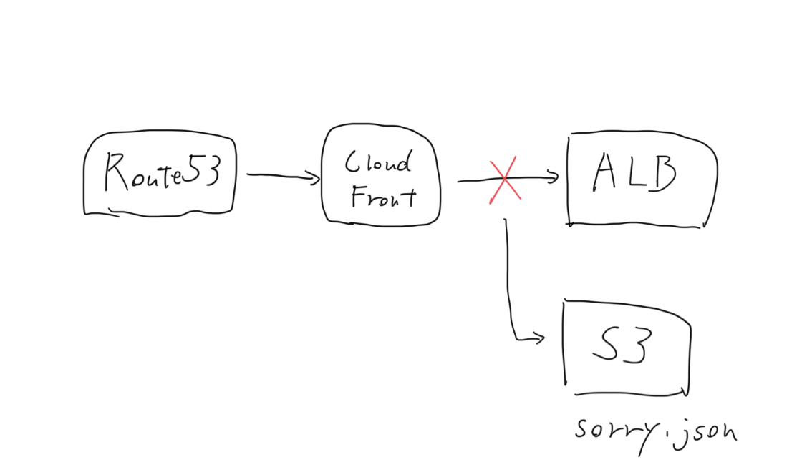

# Sorry Page Pattern

Webアプリケーションの前段にCloudFrontを置き、サーバーの障害やメンテナンス時にはアプリケーションではなくS3バケットの静的ファイルを代替として表示させる。

http://aws.clouddesignpattern.org/index.php/CDP:Sorry_Page%E3%83%91%E3%82%BF%E3%83%BC%E3%83%B3

CloudFrontとALBの間にWAFを挟みIP制限をするようにすれば、WAFのルールを変更する(例：全てのIPをブロックする)ことで、メンテナンスモードに明示的に入ることができる。

https://dev.classmethod.jp/cloud/aws/cloudfront_aws-waf_mainte/
